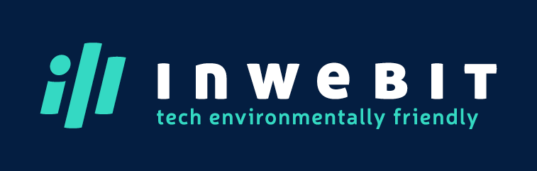
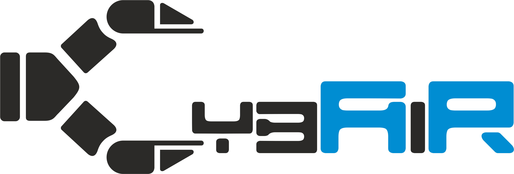

# Hello there 😎

## My projects 🚧

- [Perception in Robotics](perception_in_robotics.md)
- [Reinforcement Learning with snake](https://filesmuggler.github.io/sneaky_snakes/)
- [European Rover Challenge](erc.md)

## How-tos by me ✨
- [How to set a Husky robot under ROS2](https://ppi-put.github.io/put-husky/)
- [How to install ROS on RPI and not to loose mind](ros4rpi.md)
- [How to run IMU under ROS Melodic on RPI Zero and survive](imu4rpi.md)

## About me 🛀

### Socials

Feel free to contact me in any form!

### Technological stack and favourite tools

### Work and affiliations

[!](cybair.put.poznan.pl/)

[!](https://roverchallenge.eu/)

## Check it out! 🗺️

